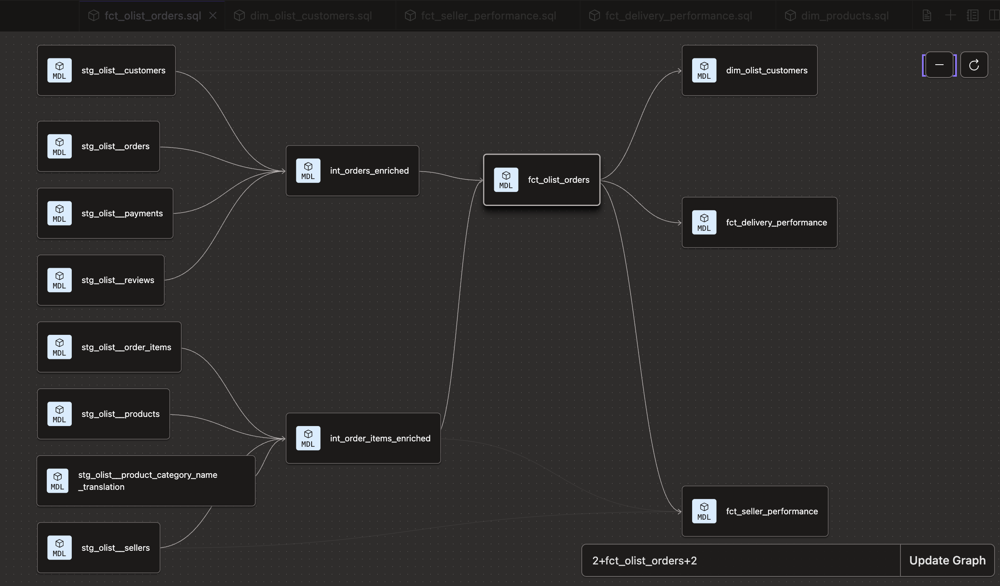

# Olist E-Commerce Analytics Pipeline

An end-to-end analytics engineering project built with Snowflake and dbt using Brazilian e-commerce data from the Olist marketplace on Kaggle.

## Project Overview

Olist is a Brazilian e-commerce marketplace connecting sellers to customers across Brazil. This project models raw transactional data into a clean, tested, and documented analytics layer to answer key business questions around revenue, delivery performance, seller quality, and customer behavior.

## Architecture

Kaggle CSVs → Snowflake (RAW_OLIST) → dbt staging → intermediate → marts
## DAG

## Project Structure

models/staging/olist — one model per source table, materialized as views

models/intermediate — joined and enriched models, materialized as views

models/marts/core — foundation fact and dimension tables

models/marts/marketing — seller and product performance models

models/marts/finance — delivery performance models

## Models

### Staging
| Model | Description |
|---|---|
| stg_olist__orders | Cleaned orders with renamed columns and cast timestamps |
| stg_olist__customers | Cleaned customer location data |
| stg_olist__order_items | Cleaned order items with product and seller references |
| stg_olist__payments | Cleaned payment data including installments |
| stg_olist__reviews | Cleaned customer reviews with scores |
| stg_olist__products | Cleaned product catalog with dimensions |
| stg_olist__sellers | Cleaned seller location data |
| stg_olist__geolocation | Cleaned zip code geolocation data |
| stg_olist__product_category_name_translation | Portuguese to English category translations |

### Intermediate
| Model | Description |
|---|---|
| int_orders_enriched | Orders joined with customers, payments, and reviews |
| int_order_items_enriched | Order items joined with products and sellers |

### Marts
| Model | Description |
|---|---|
| fct_olist_orders | One row per order with full delivery, payment, and review context |
| dim_olist_customers | Customer profiles with lifetime value and order history |
| fct_seller_performance | Seller revenue, review scores, and delivery metrics |
| fct_delivery_performance | Delivery performance and late order rates by Brazilian state |
| dim_products | Product catalog with English category names and sales metrics |

## Business Questions Answered

- What product categories drive the most revenue?
- Which Brazilian states have the worst delivery performance?
- What percentage of orders are delivered late and by how much?
- Which sellers have the highest customer satisfaction scores?
- What is the lifetime value of customers by state?
- How does delivery performance affect review scores?

## Data Quality

- 30+ tests across all models including uniqueness, not null, and accepted values
- Warning-level tests on nullable metrics to flag data quality issues without breaking the pipeline

## Stack

- **Snowflake** — cloud data warehouse
- **dbt Cloud** — transformation and documentation
- **GitHub** — version control

## Dataset

Brazilian E-Commerce Public Dataset by Olist — available on [Kaggle](https://www.kaggle.com/datasets/olistbr/brazilian-ecommerce)

99,441 orders from 2016 to 2018 across multiple marketplaces in Brazil.

<<<<<<< HEAD
=======

>>>>>>> 580c518a8fa3165c247417bd95281f8ddd11935b
